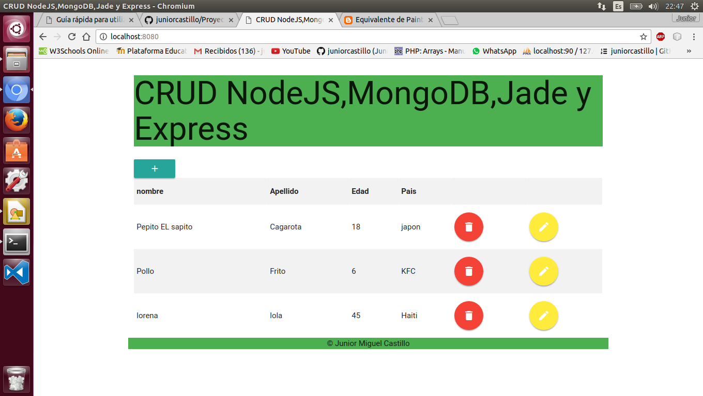
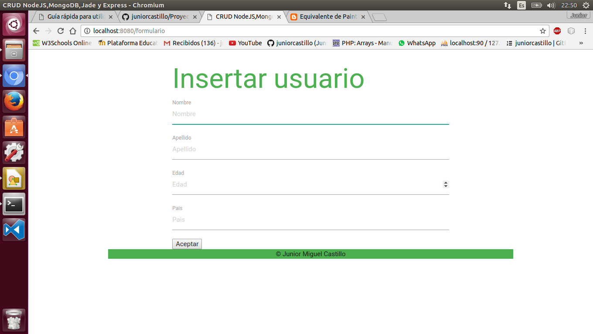

# CRUD en Node.Js con Express, Jade y Base de datos MongoDB 
## CRUD realizado en Node.js con Express y Jade sobre base de datos MondoDB.

**Listado CRUD**
 

**Modificacion CRUD**

**Alta nuevo usuario CRUD**

